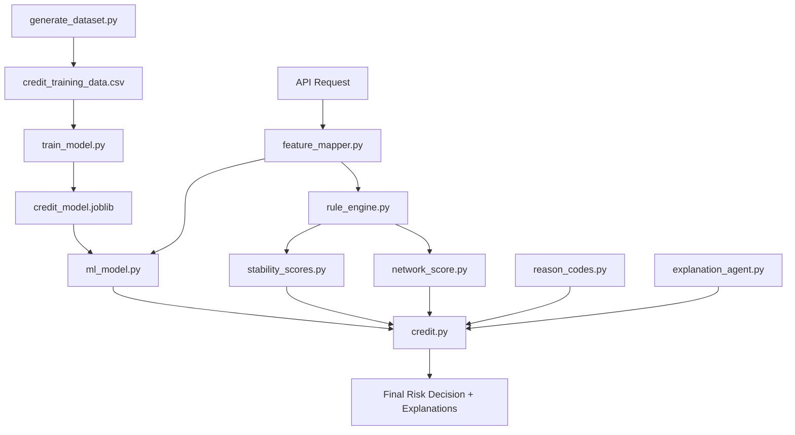

# SentinelFraud Credit Risk Engine — Technical Documentation

> **A Fraud-Aware, Explainable Credit Risk Assessment System with Advanced Behavioral Signals**

---

## 1️⃣ System Overview

### What The System Does

SentinelFraud is an **intelligent credit risk assessment engine** that evaluates user profiles and predicts their risk category (Low / Moderate / High) using a hybrid approach combining:

1. **Rule-Based Scoring** — Deterministic, auditable business logic
2. **Machine Learning Scoring** — Data-driven probability estimation trained on synthetic fintech user data
3. **Network Trust Signals** — Community Trust Coefficient (CTC) based on contact network quality
4. **Behavioral Stability Signals** — 10+ advanced signals including income rhythm, savings cadence, device persistence, and more

### Problem It Solves

| Problem | SentinelFraud Solution |
|---------|------------------------|
| **Black-box decisions** | Provides explainable reason codes + signal-level breakdown |
| **Static rule thresholds** | Combines dynamic ML + rules + behavioral signals |
| **No fraud awareness** | Integrates fraud flags, chargebacks, device trust, network signals |
| **Ignores context** | Considers income stability, geo-resilience, repayment velocity |
| **Single-point estimate** | Returns uncertainty band (PD ± x%) |

### How It Differs from Traditional Credit Scores

```
Traditional Credit Score          SentinelFraud v2.0
─────────────────────────         ──────────────────
Single number (e.g., 750)    →    Score + uncertainty band + reason codes
Static bureau data           →    Real-time behavioral + network signals
No fraud integration         →    CTC, device trust, chargebacks
Unexplainable                →    Full signal-by-signal transparency
Individual only              →    Community trust coefficient
```

---

## 2️⃣ End-to-End Code Flow



### Stage 1: Data Generation (`generate_dataset.py`)

**Purpose:** Creates 1000 synthetic user profiles with behavioral and network signals.

| Step | Description |
|------|-------------|
| **Occupation Profiling** | 10 occupation types with distinct behavioral distributions |
| **Feature Generation** | Age, income, transactions, location risk, device behavior, fraud history |
| **Network Profiling** | CTC signals: contact credit scores, risk ratios, network stability |
| **Address Profiling** | Address tenure, change frequency |
| **Noise Injection** | 10% controlled anomalies for realism |

### Stage 2: Model Training (`train_model.py`)

**Purpose:** Trains logistic regression classifier on generated data.

| Step | Description |
|------|-------------|
| **Feature Selection** | 9 core ML features (unchanged for backward compatibility) |
| **Stratified Split** | 80/20 train/test split |
| **Training** | Logistic Regression with L-BFGS, 2000 iterations |
| **Evaluation** | AUC ~0.904 for High-risk detection |

### Stage 3: Real-Time Scoring

Three API endpoints available:

| Endpoint | Purpose |
|----------|---------|
| `POST /credit/assess` | Standard assessment with CTC + address |
| `POST /credit/explain` | Customer-friendly email/SMS explanations |
| `POST /credit/assess/full` | Complete signal breakdown with uncertainty band |

---

## 3️⃣ Advanced Signals & Score Fusion

### Score Fusion Formula

```
Final Score = 0.6 × ML_Score + 0.4 × Enhanced_Rule_Score

Enhanced_Rule_Score = Base_Rule_Score 
                    - Network_Adjustment (CTC ±10%, Address ±5%)
                    - Stability_Adjustment (±15%)
```

**All adjustments are CAPPED to prevent any single signal from dominating.**

### Signal Categories & Impact Caps

#### Category 1: Core ML Features (Fixed, No Retraining)

| Feature | Description |
|---------|-------------|
| `age` | User age |
| `monthly_income` | Income stability indicator |
| `transaction_count_30d` | Behavioral intensity |
| `avg_transaction_amount` | Spending patterns |
| `location_risk_score` | Geo-based exposure |
| `device_change_frequency` | Identity trust signal |
| `previous_fraud_flag` | Historical risk |
| `account_age_months` | Platform tenure |
| `chargeback_count` | Dispute history |

#### Category 2: Network & Community Signals

| Signal | Description | Max Impact |
|--------|-------------|------------|
| **Community Trust Coefficient (CTC)** | Aggregated quality of user's contact network | **±10%** |
| `avg_contact_credit_score` | Average credit score of contacts (300-900) | — |
| `low_risk_contact_ratio` | Ratio of low-risk contacts | — |
| `high_risk_contact_ratio` | Ratio of high-risk contacts | — |
| `network_stability_ratio` | Network relationship stability | — |
| **Address Stability** | Tenure and change frequency | **±5%** |

#### Category 3: Behavioral Stability Signals

| Signal | Description | Max Impact |
|--------|-------------|------------|
| **Income Rhythm Stability** | Regularity of income after seasonal adjustment | **±7%** |
| **Savings Cadence** | Frequency + persistence of micro-savings | **±5%** |
| **Device Persistence** | Stability of device fingerprint | **±4%** |
| **Expense Elasticity** | How spending reacts to income changes | **±4%** |
| **Utility Stability** | Timeliness of utility payments | **±3.5%** |
| **Merchant Loyalty** | Repeat purchases vs refunds/disputes | **±3%** |
| **Repayment Velocity** | Early vs on-time vs late payment tendency | **±5%** |
| **Geo-Resilience** | Sensitivity to local economic shocks | **±4%** |

**Total Stability Composite Cap: ±15%**

---

## 4️⃣ CTC (Community Trust Coefficient) Computation

### Formula

```python
CTC = (
    0.4 × normalized_avg_contact_credit_score +
    0.3 × low_risk_contact_ratio +
    0.2 × network_stability_ratio +
    0.1 × (1 − high_risk_contact_ratio)
)
```

### Privacy Safeguards

- ✅ No raw contact data stored
- ✅ Aggregated scores only
- ✅ No relationship graph exposure
- ✅ Hashed identifiers only

---

## 5️⃣ Noise Handling & Real-World Imperfections

### Why Noise Matters

Real-world data contains contradictory signals. Training only on clean data leads to:
- Overfitting to unrealistic patterns
- Poor generalization to edge cases
- Inability to handle borderline users

### Controlled Noise Injection (10%)

| Noise Type | Description |
|------------|-------------|
| `high_income_fraud` | High earner with fraud flag + chargebacks |
| `low_income_high_volume` | Low income + 4× transaction volume |
| `high_location_risk` | Elevated location score with normal behavior |
| `device_anomaly` | 6–10 device changes + fraud flag |
| `borderline_moderate` | Values near category thresholds |

---

## 6️⃣ API Response Structures

### Standard Assessment (`/credit/assess`)

```json
{
  "assessment_id": "CR-U_0001-20251225120000",
  "timestamp": "2025-12-25T12:00:00",
  "applicant": {
    "user_id": "U_0001",
    "age": 32,
    "occupation": "salaried"
  },
  "rule_scoring": {
    "base_score": 420,
    "ctc_adjustment": -50,
    "address_adjustment": -25,
    "final_rule_score": 345
  },
  "ml_scoring": {
    "high_risk_probability": 0.234,
    "model_auc": 0.904
  },
  "decision": {
    "final_credit_score": 308,
    "risk_band": "Low",
    "reason_codes": []
  },
  "compliance": {
    "ctc_max_impact": "±10%",
    "address_max_impact": "±5%"
  }
}
```

### Full Assessment (`/credit/assess/full`)

Includes all of the above plus:

```json
{
  "decision": {
    "probability_of_default": {
      "estimate": 23.4,
      "lower_bound": 18.4,
      "upper_bound": 28.4,
      "uncertainty_pct": 10.0
    }
  },
  "network_trust": {
    "ctc_score": 0.72,
    "available": true
  },
  "stability": {
    "composite_score": 0.68,
    "signals_available": 6
  },
  "behavioral_signals": {
    "income_rhythm": {"score": 0.75, "category": "Stable"},
    "savings_cadence": {"score": 0.60, "category": "Moderate"},
    "device_persistence": {"score": 0.85, "trust_level": "High"},
    "repayment_velocity": {"score": 0.70, "category": "On-Time"}
  },
  "key_factors": [
    {"factor": "Strong network trust (CTC)", "direction": "positive"},
    {"factor": "Good income rhythm", "direction": "positive"}
  ]
}
```

---

## 7️⃣ Architecture Summary

```
┌─────────────────────────────────────────────────────────────────┐
│                    SentinelFraud Engine v2.0                     │
├─────────────────────────────────────────────────────────────────┤
│  DATA LAYER                                                      │
│  ├── generate_dataset.py    (Synthetic data + network + noise)  │
│  └── credit_training_data.csv  (1000 rows, 18 columns)          │
├─────────────────────────────────────────────────────────────────┤
│  ML LAYER                                                        │
│  ├── train_model.py         (Logistic Regression)               │
│  └── credit_model.joblib    (Serialized model)                  │
├─────────────────────────────────────────────────────────────────┤
│  SCORING LAYER                                                   │
│  ├── rule_engine.py         (Base + Enhanced + Full scoring)    │
│  ├── network_score.py       (CTC + Address stability)           │
│  ├── stability_scores.py    (8 behavioral signals)              │
│  ├── ml_model.py            (ML inference)                      │
│  ├── feature_mapper.py      (Request → Features)                │
│  ├── reason_codes.py        (Explainability)                    │
│  └── explanation_agent.py   (Customer-facing messages)          │
├─────────────────────────────────────────────────────────────────┤
│  API LAYER                                                       │
│  ├── /credit/assess         (Standard assessment)               │
│  ├── /credit/assess/full    (Complete signal breakdown)         │
│  └── /credit/explain        (Email/SMS explanations)            │
└─────────────────────────────────────────────────────────────────┘
```

---

## 8️⃣ Compliance & Explainability

### Regulatory Safeguards

| Requirement | Implementation |
|-------------|----------------|
| **Explainability** | Full signal-level breakdown in API response |
| **Fair Lending** | No single signal can flip risk band alone |
| **Privacy** | No PII stored, network signals aggregated |
| **Auditability** | Deterministic scoring with capped impacts |
| **Transparency** | Model AUC and uncertainty band exposed |

### Impact Caps Summary

| Adjustment Type | Maximum Impact |
|-----------------|----------------|
| CTC Network Trust | ±10% (±100 points) |
| Address Stability | ±5% (±50 points) |
| Stability Composite | ±15% (±150 points) |
| Total Post-ML Adjustments | ±25% |

---

**Document Updated:** December 25, 2025  
**System Version:** SentinelFraud Credit Risk Engine v2.0
